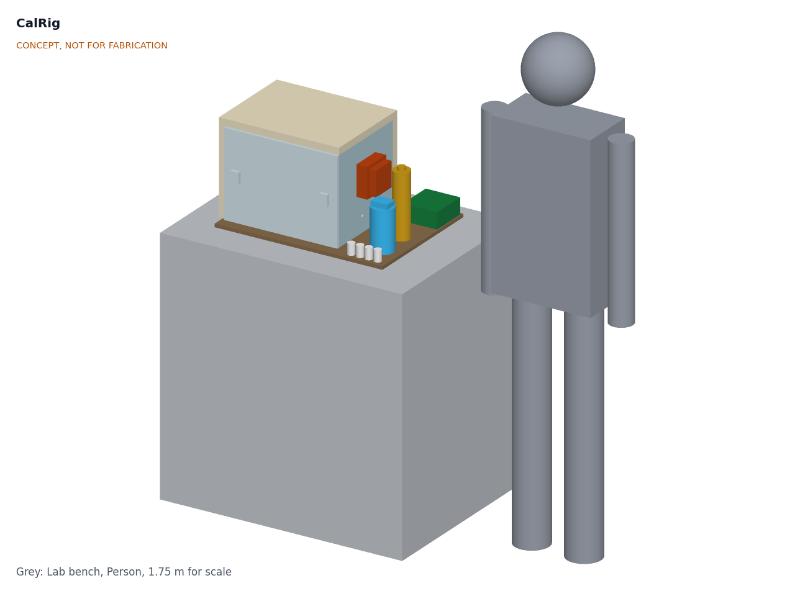
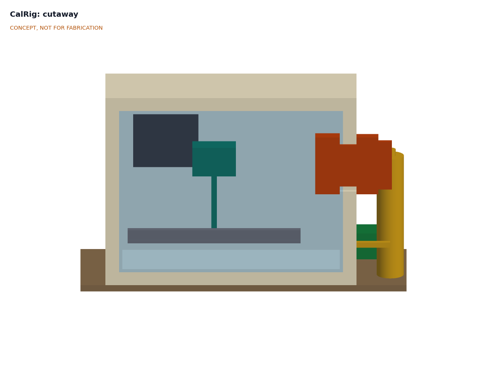
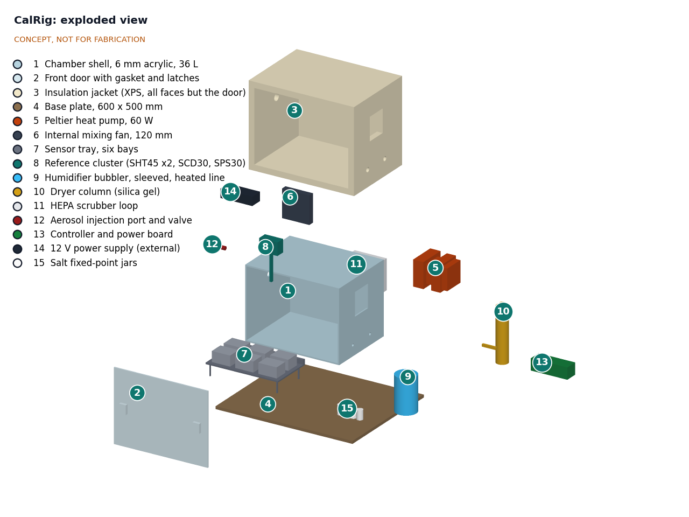

# CalRig design precis

## Summary

CalRig is a 36 L insulated acrylic chamber on a bench-top base. A Peltier heat pump sets the temperature, a heated bubbler and a silica gel dryer set the humidity, a HEPA loop gives clean air and a controlled smoke decay for particle tests, and a reference cluster (two Sensirion SHT45 temperature and humidity sensors, a Sensirion SCD30 CO2 sensor and a collocated Sensirion SPS30 particle sensor) sits among six sensors under test. A small controller steps through set points and logs everything; a laptop script fits a correction for each sensor and writes a dated record. The calculations in CLR-CAL-001 v0.2 show that it meets twelve of the eighteen requirements in CLR-REQ-001. It misses the $400 budget by about $12 (about $412 in parts), and it still depends on a collocation site for its particle reference.

Figure 1. CalRig massing model on a lab bench, with a 1.75 m person for scale. Concept, not for fabrication.

## How it works

1. **Load.** Up to six sensor heads sit in the bays of a tray inside the chamber. Their leads pass through a sealed gland to a USB and I2C hub. The door is closed and latched.
2. **Check the references.** Before a campaign (monthly is proposed), the two SHT45 references are checked at four saturated salt fixed points (11, 33, 75 and 84 % RH at 25 °C; [Greenspan, 1977](https://nvlpubs.nist.gov/nistpubs/jres/81A/jresv81An1p89_A1b.pdf)) and in an ice bath at 0 °C. The SPS30 transfer sensor is collocated at a regulatory or research monitor for 30 days or more, and replaced in the chamber only if it meets the US EPA PM2.5 targets there.
3. **Temperature and humidity sweep.** The controller steps through set points, by default 20 °C and 40 °C at 40 % and 85 % RH, matching the EPA enhanced test conditions ([EPA FAQ](https://www.epa.gov/air-sensor-toolbox/frequently-asked-questions-reports-air-sensor-performance-testing-protocols)). The sweep runs from cold to hot, because cooling is the slow direction. The Peltier assembly heats or cools. Two small pumps draw air from the chamber and return it through the bubbler (wet) and the dryer (dry) at a ratio set by PWM, with about 3 L/min in total. The internal 120 mm fan mixes the chamber. Each point settles in about 22 to 31 min, then allows 15 min for the heads to equilibrate, and is held for 30 min (CLR-CAL-001, section I).
4. **Particle run.** With the HEPA loop at full speed (about 20 L/min) the chamber is cleaned to below 2 µg/m³ in about 5 min. A syringe draws a puff of smoke from an incense stick smoldering in a cup outside the chamber and injects it through the aerosol port. The HEPA loop then runs slowly (5 L/min) and the concentration decays from about 300 to 5 µg/m³ in about 28 min, giving a continuous comparison curve. The run can be repeated at a second humidity to fit the humidity term.
5. **CO2 check (optional).** Soda lime in the dryer path gives a near-zero point. One liter of exhaled breath from a bag raises the chamber by about 1,100 ppm for a span point.
6. **Fit and record.** The laptop script compares each sensor with the references, fits a slope, offset and humidity term, computes the EPA metrics (R², slope, intercept, RMSE, sensor-to-sensor precision) and writes a CSV and a one-page report per sensor serial number.

Figure 2. Cutaway looking from the door side: sensor tray with six example sensors, reference cluster on its mast, mixing fan and the Peltier assembly through the right-hand wall.

## Main components

Table 1. Main components, numbered to match the BOM and the exploded view (Figure 3).

| No. | Component | Role | Key choice |
| --- | --- | --- | --- |
| 1 | Chamber shell | 36 L sealed volume (400 x 300 x 300 mm inside) | 6 mm cast acrylic, solvent-welded; small enough to condition fast, large enough for six heads |
| 2 | Front door | Access and viewing | Clear acrylic with silicone gasket and two latches |
| 3 | Insulation jacket | Cuts the chamber conductance to about 0.82 W/K | 25 mm XPS on every face except the door, plus a removable door panel for hot, humid and cold points |
| 4 | Base plate | Carries the chamber and conditioners | 12 mm plywood or HDPE, 600 x 500 mm |
| 5 | Peltier heat pump | Heats and cools the chamber | 60 W air-to-air thermoelectric assembly; the stock inner sink is replaced by a larger fin block (about 45 x 120 x 110 mm, about 0.20 K/W with its fan) so it stays above the dew point at 20 °C and 85 % RH (CLR-DDR-002) |
| 6 | Internal mixing fan | Uniform air across the bays | 120 mm, 12 V, speed-controlled (80 mm was too small for R4) |
| 7 | Sensor tray | Holds six sensor heads, cable rail | Perforated sheet so air moves around the heads |
| 8 | Reference cluster | The known values | 2 x SHT45 (±0.1 °C, ±1.0 % RH typical, [Sensirion](https://sensirion.com/products/catalog/SHT45)), SCD30 (±(30 ppm + 3 %), [Sensirion](https://sensirion.com/products/catalog/SCD30)), SPS30 collocated transfer sensor (±10 % precision, [Sensirion](https://sensirion.com/products/catalog/SPS30)) |
| 9 | Humidifier bubbler | Wet air | 0.3 L of distilled water in a foam-sleeved jar with a 10 W heater pad, held about 3 K above chamber air; trace-heated outlet line so the wet air does not condense on the way; no ultrasonic mist, which would add particles |
| 10 | Dryer column | Dry air | Indicating silica gel, about 500 g, regenerated in an oven |
| 11 | HEPA scrubber loop | Zero air and controlled smoke decay | H13 class filter cartridge with a variable-speed fan |
| 12 | Aerosol injection port | Smoke entry | Luer port with a ball valve; the smoke source stays outside |
| 13 | Controller and power board | Control, logging and protection | ESP32 class board, Peltier H-bridge, pump and fan MOSFETs, microSD, independent thermal cut-off |
| 14 | Power supply | 12 V, 10 A | Certified external brick; no mains wiring in the rig |
| 15 | Salt fixed-point jars | Humidity reference checks | LiCl, MgCl2, NaCl and KCl slurries in sealed jars |

Figure 3. Exploded view. Callout numbers match Table 1 and `bom/bom.csv`.

## Key numbers

All values come from CLR-CAL-001 v0.2, which gives the assumptions and the script tags. They are calculations, not measurements.

Table 2. Chamber and process figures.

| Quantity | Value | Basis |
| --- | --- | --- |
| Internal volume | 36.0 L | 400 x 300 x 300 mm |
| Chamber conductance | 0.82 W/K with door panel; 1.17 W/K without | Full jacket (U 1.01 W/(m²·K)), 20 % for thermal bridges, conditioning loop 0.06 W/K |
| Internal heat gains | 6.7 W | Fans 3.9 W, six heads 2.4 W, references 0.4 W |
| Water to go from 20 to 85 % RH at 40 °C | 1.8 g | 1.19 g in the air, about 0.59 g into the acrylic surface |
| Settling per set point | 22 to 31 min, plus 15 min for the heads | Loop time constant 12 min; full-drive thermal ramps |
| Four-point sweep plus particle run | about 5.5 h | Cold to hot, 30 min holds |
| Decay 300 to 5 µg/m³ | about 28 min | HEPA 5 L/min, deposition 0.2 per hour |
| CO2 span from 1 L of breath | about +1,100 ppm | Exhaled air about 4 % CO2 |
| Peak electrical power | about 90 W, 7.5 A at 12 V | Peltier 59 W, heaters 13 W, pumps, fans, controller, sensors |
| Overall size and mass | 600 x 500 x 374 mm; about 13.6 kg | Parametric model `cad/src/model.py` |

Table 3. Temperature range with one 12706-class module at 12 V (CLR-CAL-001, section B).

| Room | Lowest chamber temperature | Heating to 40 °C |
| --- | --- | --- |
| 15 °C | -2.0 °C | 13.9 W needed, about 80 W available |
| 22 °C | 4.1 °C | 8.1 W needed, about 86 W available |
| 25 °C | 6.7 °C | Met |
| 30 °C | 11.1 °C | Met |

The revised R1 (10 °C in rooms of 15 to 25 °C) is met, with a 3.3 K margin at 25 °C. Cooling to 10 °C is slow, about 2.4 h in a 25 °C room, so cold points are a separate run.

**Condensation at the hot, humid point.** At 40 °C and 85 % RH the dew point is 37.0 °C. The inner face of the clear door in a 22 °C room runs at about 33 °C and condenses; with the door panel fitted it runs at about 38.2 °C, a 1.2 K margin (0.5 K in a 15 °C room). The door panel is therefore required for that point, and the wet air line is trace-heated.

**Condensation on the Peltier sink.** Holding 20 °C in the 22 °C reference room still needs about 8 W of cooling, mostly to remove the internal gains. With the stock inner sink (0.45 K/W) the sink ran about 1.2 K below the 17.4 °C dew point of air at 85 % RH and would condense about 8 g/h against about 0.7 g/h from the bubbler. The larger inner fin block (about 0.20 K/W, CLR-DDR-002) runs at about 18.3 °C, 0.9 K above the dew point, so the point holds in rooms up to about 28 °C (R2 met). A drip tray and drain stay in the design for cold points.

**Particle reference.** The chamber cannot create a traceable mass reference. It carries one from the field: a transfer SPS30 that has been collocated with a regulatory or research monitor. Chamber results then describe how each sensor compares with that transfer sensor in combustion smoke at known humidity. Reports must state the aerosol type, because optical sensors respond differently to dust, salt and smoke.

## Key design choices

These were decided by Amish on 2026-09-25 (go with recommendation; CLR-DDR-001 and CLR-DDR-002).

- **Transfer references instead of certified instruments.** Certified reference instruments cost thousands of dollars. CalRig uses good digital sensors, checked against physical fixed points (salts, ice) and field collocation. This keeps the rig near its budget and makes the uncertainty chain explicit.
- **Heated bubbler, not an ultrasonic mister.** Ultrasonic misters make mineral particles that would corrupt particle tests.
- **Smoke decay, not a nebulizer.** A decay curve covers the whole range in one run with no dilution hardware. Every report states the aerosol type (CLR-DDR-001 A4).
- **Accept the cooling limit.** One Peltier module; 10 °C only in rooms at 25 °C or below, and the lowest point stated in each record for warmer rooms (CLR-DDR-001 A3).
- **Insulated door panel** for hot, humid and cold points (CLR-DDR-001 A6).
- **Larger inner Peltier sink** (about 0.20 K/W) so the 20 °C, 85 % RH point holds in normal rooms (CLR-DDR-002).
- **Mass limit of 14 kg.** CalRig is a bench rig, so the 12 kg limit was relaxed rather than thinning the acrylic (CLR-DDR-002).
- **Certified temperature probe if the budget allows.** It does not yet ($412 against $400), so R5 stays at risk (CLR-DDR-002).
- **External 12 V supply.** Keeps mains voltage out of a box that holds water.
- **Temperature and humidity first, CO2 optional, no toxic gases.** NO2 sensors, including AirStreet's, are calibrated by field collocation only (CLR-DDR-001 A5).

## Links to other projects

- **AirStreet** describes itself as "calibrated on CalRig" for PM2.5 and NO2. CalRig covers PM2.5 and the temperature and humidity terms; AirStreet's README already states that NO2 is calibrated by field collocation.
- **HeatMap Node** (heat and humidity), **DustBadge** (dust) and **FieldNode** sensor heads are intended users. DustBadge measures respirable dust, so a smoke-based chamber result will not transfer directly to mineral dust.

## Safety

> **Safety:** The Peltier hot-side heat sink can reach 60 to 70 °C; keep it guarded and away from the acrylic. An independent thermal cut-off opens the heater circuit at 50 °C chamber air or 70 °C hot side. The 12 V bus carries up to about 7.5 A: fuse it at 10 A at the supply and use rated wire. The bubbler heater pad and the line trace each have a thermistor and are switched off by the same cut-off. Use only a certified external supply; never wire mains into the rig, which contains water.

> **Safety:** Test smoke contains fine particles and combustion gases, including carbon monoxide in small amounts. Light the incense in a cup outside the chamber, in a ventilated room, and run the HEPA loop until the reference reads below 5 µg/m³ before opening the door. No toxic calibration gases are used in this version.

> **Safety:** Soda lime is corrosive and lithium chloride is harmful if swallowed. Wear gloves and eye protection when filling cartridges and salt jars, label them, and keep them away from children. Cast acrylic is combustible: keep heaters and hot surfaces off the shell. Keep electronics below and outside the chamber so condensation cannot reach them. Fans have guards. Exhaled air for CO2 checks goes through a single-user bag and filter.

## Open questions

- [ ] Budget: $412 in parts against `budget_usd` of $400. Accept about $412, drop CO2 for a core version at about $345, or find $12 of savings (proposed, awaiting Amish).
- [ ] Particle reference: which collocation site (regulatory monitor, university, AQ-SPEC style program) will host the transfer SPS30, and how often it returns there (awaiting Amish).
- [ ] Inner fin block: confirm a part that reaches about 0.20 K/W with the inner fan.
- [ ] Report format: what a city or funder would accept as evidence.
