# CalRig prototype build plan

**Plan, not yet built.** How to build the first proof-of-concept prototype, component by component. Building and testing to it is TRL 4 work. Decisions still to be made are kept in the design decisions register ([docs/06-design-decisions.md](06-design-decisions.md)), not here.

## 1. What you are building

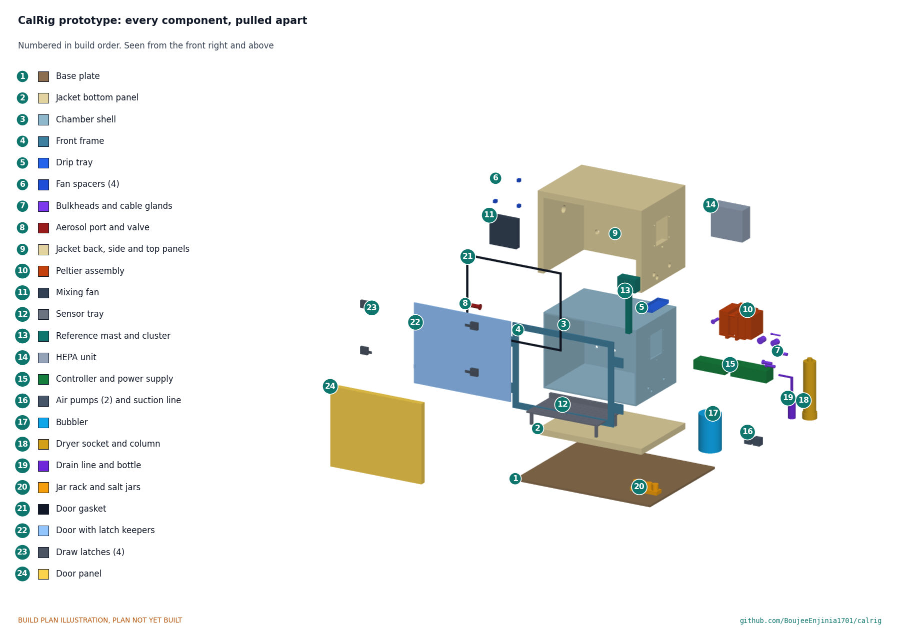

*Figure 1. Every component pulled apart and numbered in build order, seen from the front right and above.*

The prototype is one CalRig on a bench: a 36 L clear acrylic box wrapped in foam board, with a door at the front, a heat pump through its right wall, and the conditioning parts, the HEPA unit and the electronics standing on a plywood base around it. Figure 1 shows the 24 components in the order you make or fit them. Ten are made in a workshop or maker space: the base plate, the five jacket panels, the chamber shell with its welded front frame, drip tray and fan spacers, the sensor tray, the door and the door panel from sheet, and three small printed parts (the reference mast, the dryer socket and the jar rack). The rest are bought and fitted: the heat pump, fans, pumps, bubbler, dryer column, HEPA unit, bulkhead fittings and cable glands, latches, sensors, controller and power supply. The work is laser cutting and solvent welding acrylic, cutting foam board, a little drilling and printing, and wiring bought modules together with screw terminals. The parts cost about $439, from the bill of materials.

> **Safety:** The rig runs from a certified external 12 V supply; no mains wiring is inside it. The heat pump's outer sink reaches 50 °C and its hot side can reach 70 °C; the heaters and heat pump are cut off by two bimetal switches whatever the software does. Test smoke contains fine particles and some carbon monoxide: light the incense outside the chamber in a ventilated room and clear the chamber through the HEPA unit before opening the door. Soda lime is corrosive and lithium chloride is harmful if swallowed: wear gloves and eye protection. Acrylic solvent cement and laser-cut acrylic give off fumes: work in a ventilated space.

## 2. What changed to make it buildable

The concept showed what the rig does; some of its parts could not be made or fixed as drawn. Each change below keeps what the rig does, and all of them are recorded in decision record CLR-DDR-003, open for Amish's review.

*Table 1. Changes from the concept.*

| Component | The concept had | The buildable design has | Why |
| --- | --- | --- | --- |
| Door | A door the size of the shell, sealing on the 6 mm wall edges; two latches with nothing to catch | A welded front frame with a 25 mm gasket face, a 430 x 330 mm door and four draw latches on frame tabs (Figures 5 and 25) | The gasket needs a face to seal on and the latches something to pull against |
| Door panel | A full-front foam panel standing loose in front of the latches | A 406 x 330 mm panel on the door, between the latches, on four hook-and-loop pads (Figure 22) | Held in place and off by hand |
| Heat pump | No clamping to the wall | Both sink bases clamp the wall with four screws through rigid sleeves in the foam (Figure 14) | Standard mounting for a through-wall heat pump |
| Mixing fan | Floating off the back wall | Four welded spacers, fan 15 mm off the wall (Figure 15) | No hole through the wall |
| Sensor tray and reference mast | Thin posts; the mast floated behind the tray | 10 mm legs; a printed mast standing on the floor against the tray's rail (Figure 18) | Both stand on the floor and come out through the door |
| Air loops | Lines ending at the foam with no way through the wall; no outlet for the pumps; the HEPA unit not connected | Five 12 mm bulkhead fittings (wet inlet, dry inlet, suction, two to the HEPA unit) and two pumps on the base (Figures 11 to 13 and 23) | A closed loop needs a way out of the chamber as well as in |
| Sensor leads | One gland in the door | Two cable glands in the back wall (Figure 13) | Leads stay put when the door opens |
| Drip tray and drain | Named in the concept but not drawn | A tray under the inner sink, a drain fitting and a bottle on the base (Figure 9) | Condensate at cold points leaves the chamber |
| Base plate | 12 mm plywood or HDPE | 9 mm sealed birch plywood | Keeps the rig under the 14 kg limit after the added parts (13.8 kg) |

## 3. Making the components

Make and check each component before the assembly step that needs it. Sizes are in millimetres. "Left" and "right" are as seen standing at the front of the rig, looking at the door. Workshop tolerance is 0.5 mm unless a step says otherwise; drawings do not carry tolerances before TRL 4.

### 3.1 Base plate

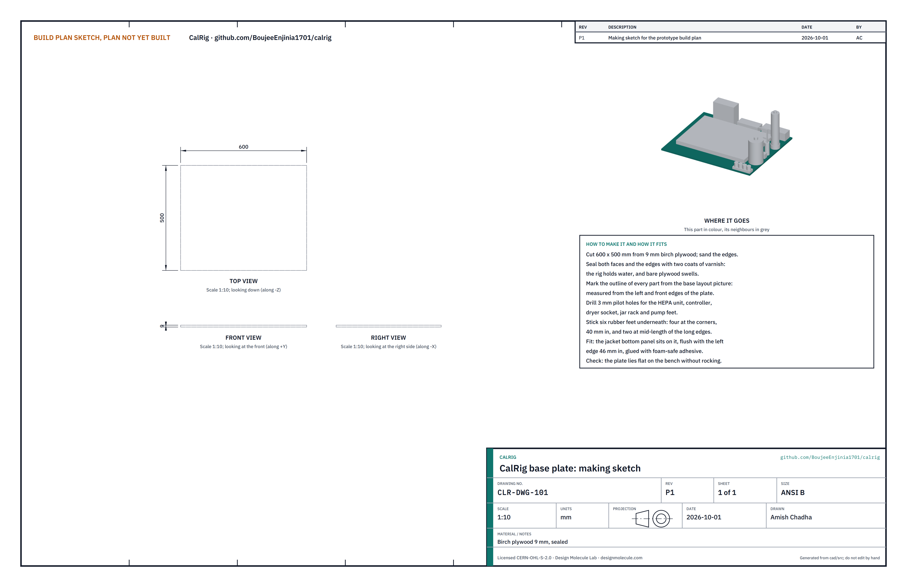

*Figure 2. Base plate making sketch (CLR-DWG-101).*

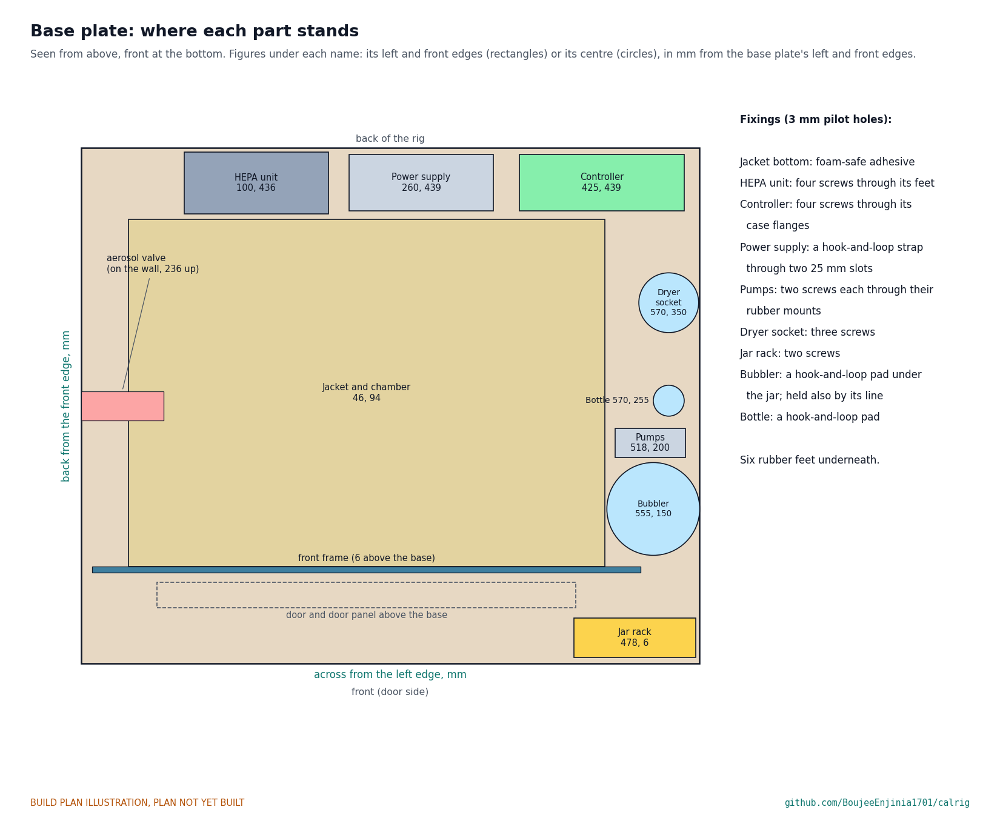

*Figure 3. Where each part stands, measured from the base plate's left and front edges.*

**What it is and what it is made from.** The board everything stands on. Birch plywood 9 mm thick, cut to 600 x 500 mm.

**How to make it.**

1. Cut the blank to 600 x 500 mm, square, and sand the edges.
2. Seal both faces and all edges with two coats of varnish. The rig holds water, and bare plywood swells.
3. Mark the outline of every part from Figure 3, measured from the left and front edges.
4. Drill 3 mm pilot holes for the screws of the HEPA unit, controller, pumps, dryer socket and jar rack, through the marked feet or flanges of each part.
5. Cut two 25 mm slots for the power supply's strap, either side of its outline.
6. Stick six rubber feet underneath: four at the corners, 40 mm in, and two at mid-length of the long edges.

**How it fits the parts next to it.** The jacket's bottom panel is glued flat on it, 46 mm from the left edge and 94 mm from the front edge. Everything else stands on it and is screwed, strapped or padded down as Figure 3 lists.

**Check before moving on.** The plate lies flat on the bench without rocking.

### 3.2 Insulation jacket

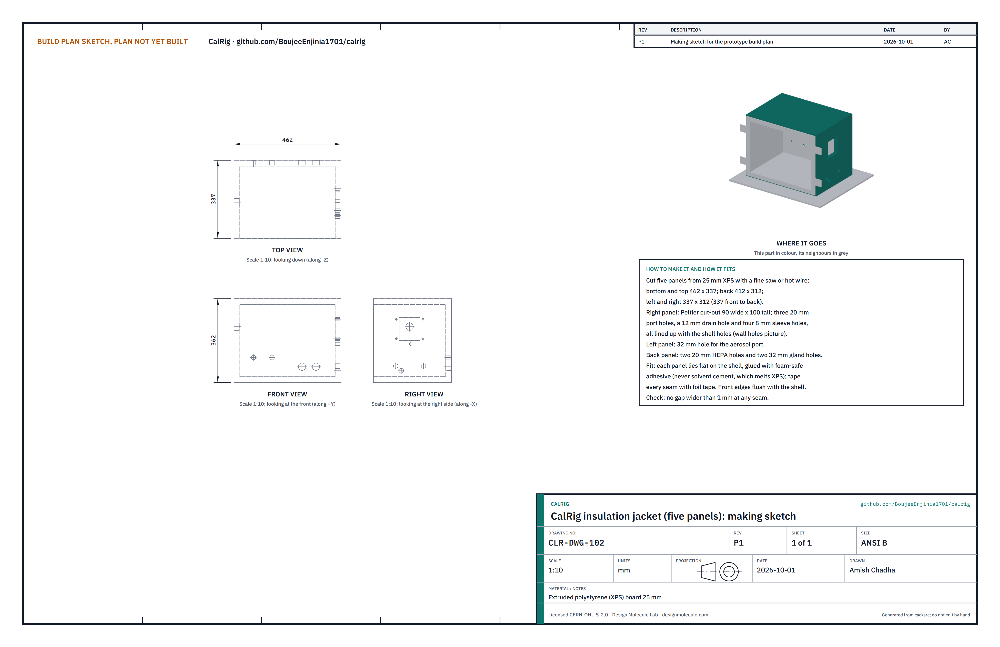

*Figure 4. Insulation jacket making sketch (CLR-DWG-102). The hole positions are in Figure 6.*

**What it is and what it is made from.** Five panels of 25 mm extruded polystyrene board that wrap the shell on every face but the front. One 1.2 x 1.2 m sheet is enough.

**How to make it.**

1. Cut the bottom and top panels 462 x 337 mm, the back panel 412 x 312 mm, and the left and right panels 337 mm front to back by 312 mm tall. A fine-toothed saw or a hot wire gives a clean edge.
2. Right panel: cut the heat pump opening 90 wide by 100 tall, three 20 mm holes for the air fittings, a 12 mm hole for the drain and four 8 mm holes for the clamp sleeves, at the positions of Figure 6 plus 6 mm up (the side panels sit on the bottom panel).
3. Left panel: a 32 mm hole for the aerosol port.
4. Back panel: two 20 mm holes for the HEPA fittings and two 32 mm holes for the cable glands, at the positions of Figure 6 plus 6 mm along and 6 mm up.
5. Hold each panel against the shell (section 3.3) to check that every hole lines up before gluing anything.

**How it fits the parts next to it.** The bottom panel is glued to the base; the shell sits on it; the other four panels lie flat against the shell, glued with foam-safe adhesive (never acrylic solvent cement, which melts the foam). Every seam is taped with foil tape. The front edges are flush with the front of the shell, and the front frame covers the inner 19 mm of them (Figure 5).

**Check before moving on.** No gap wider than 1 mm at any seam; every hole is clear of the fitting that passes through it.

### 3.3 Chamber shell, with its fan spacers

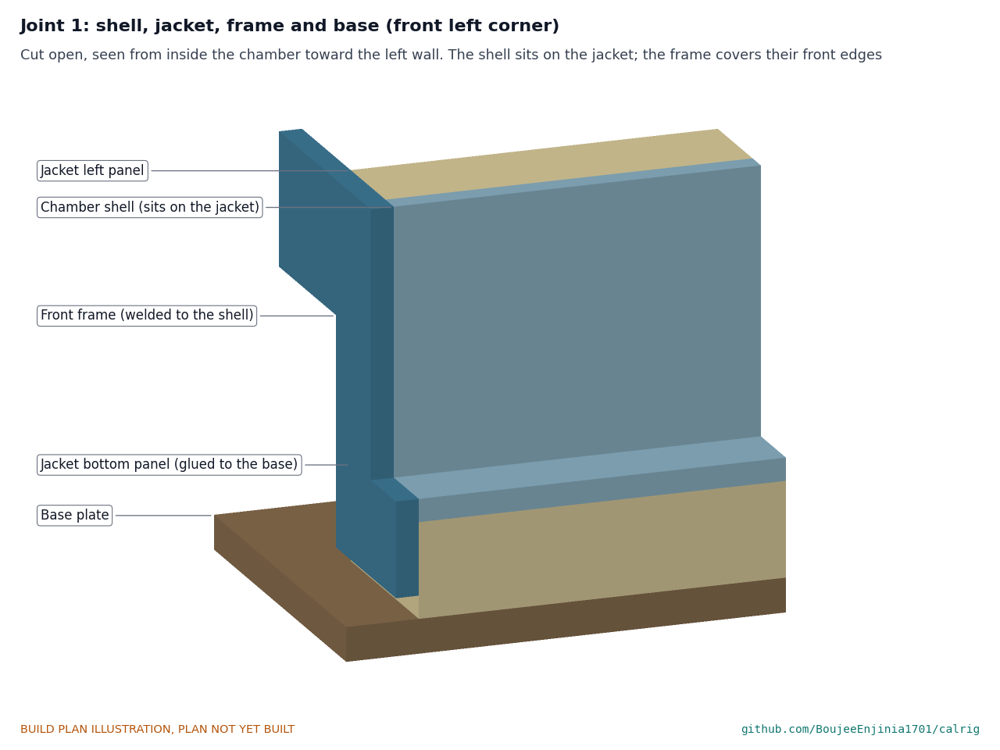

*Figure 5. The front left corner cut open: the shell sits on the jacket's bottom panel, which is glued to the base; the front frame is welded to the shell and covers the jacket's front edges.*

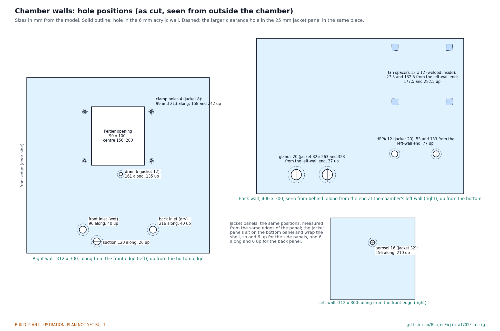

*Figure 6. Hole positions in the right, back and left walls as cut, seen from outside, with the larger jacket holes dashed.*

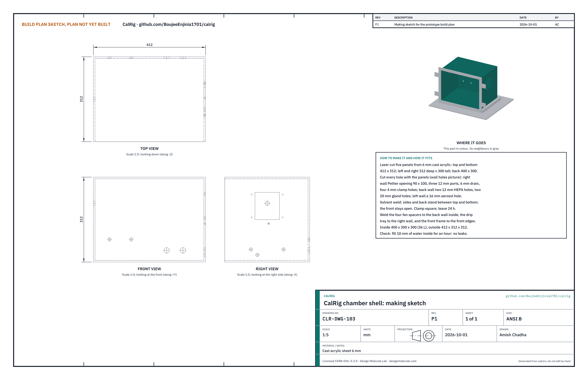

*Figure 7. Chamber shell making sketch (CLR-DWG-103).*

**What it is and what it is made from.** The sealed five-sided box the sensors sit in, 400 x 300 x 300 mm inside (36 L), open at the front. Cast acrylic sheet 6 mm thick; cast, not extruded, because it welds and machines without crazing.

**How to make it.**

1. Laser cut five panels: top and bottom 412 x 312 mm; left and right 312 mm deep by 300 mm tall; back 400 x 300 mm.
2. Cut every hole with its panel, at the positions of Figure 6. Right wall: the heat pump opening 90 wide by 100 tall, centred 156 from the front edge and 200 up; three 12 mm holes for the wet inlet, dry inlet and suction; a 6 mm drain hole; four 4 mm clamp holes. Back wall: two 12 mm holes for the HEPA fittings and two 20 mm holes for the cable glands. Left wall: a 16 mm hole for the aerosol port.
3. Cut four fan spacers 12 x 12 x 15 mm from offcut and drill and tap each M4 down its length.
4. Solvent weld the box: the sides and the back stand on the bottom panel, between the sides, and the top sits on them. The front stays open. Clamp it square with corner blocks and leave it 24 hours.
5. Weld the four spacers to the inside of the back wall at the positions of Figure 6.
6. Weld the drip tray (section 3.5) and the front frame (section 3.4) when they are made.

**How it fits the parts next to it.** The bottom sits flat on the jacket's bottom panel, glued with foam-safe adhesive (Figure 5). Every fitting seals on the acrylic with an O-ring outside and a nut inside; the jacket holes are clear of them.

**Check before moving on.** Stand the box on its back and pour in 10 mm of water: after an hour there is no leak at any weld. Dry it fully.

### 3.4 Front frame

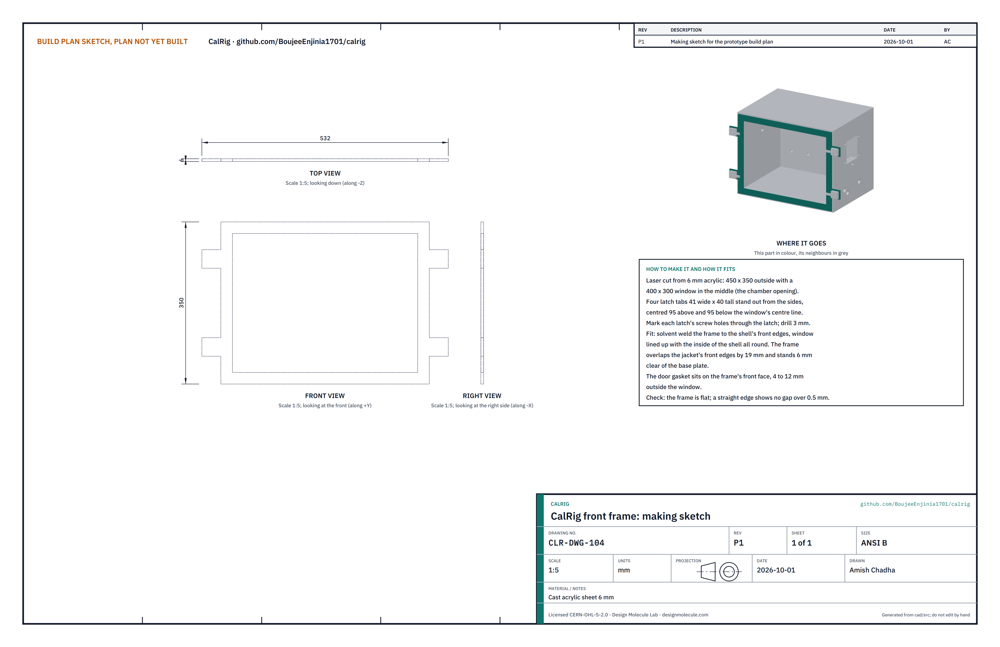

*Figure 8. Front frame making sketch (CLR-DWG-104).*

**What it is and what it is made from.** A flat frame welded to the front of the shell, which gives the door gasket a face to seal on and carries the four latches. Cast acrylic sheet 6 mm.

**How to make it.**

1. Laser cut a 450 x 350 mm frame with a 400 x 300 mm window in the middle.
2. Include four tabs 41 wide by 40 tall standing out from the sides, centred 95 above and 95 below the window's centre line.
3. Hold a latch on each tab, mark its screw holes and drill 3 mm.

**How it fits the parts next to it.** Solvent weld it to the shell's front edges with the window lined up with the inside of the shell all round. It overlaps the jacket's front edges by 19 mm (Figure 5) and stands 6 mm clear of the base plate. The gasket goes on its front face, 4 to 12 mm outside the window (Figure 25).

**Check before moving on.** A straight edge across the frame shows no gap over 0.5 mm.

### 3.5 Drip tray

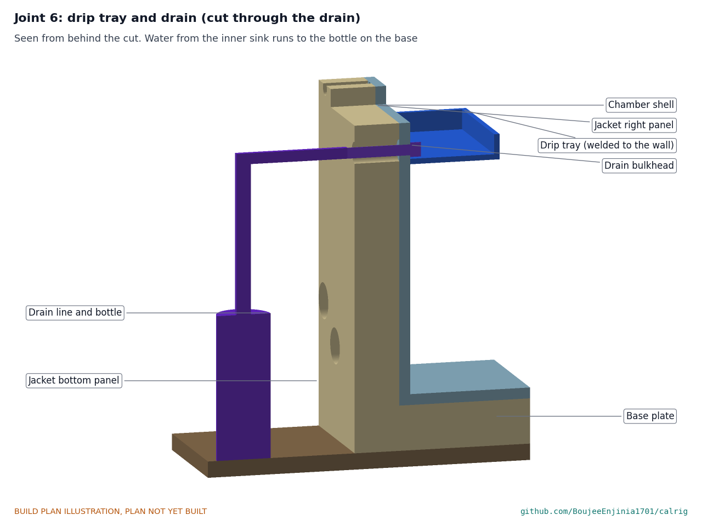

*Figure 9. Cut through the drain: water from the inner sink collects in the tray and runs through the wall to the bottle on the base.*

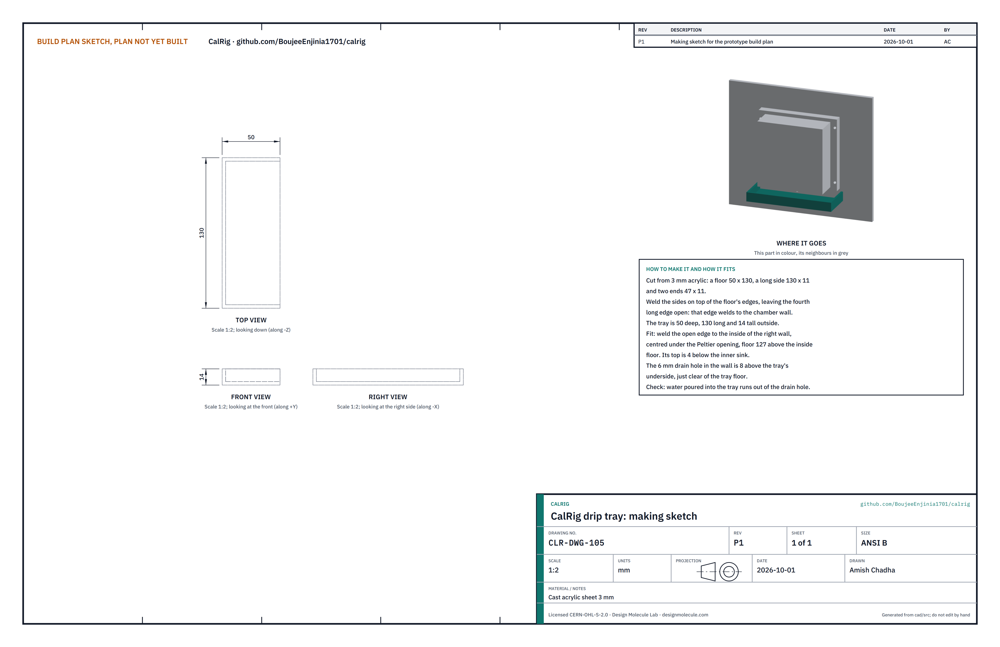

*Figure 10. Drip tray making sketch (CLR-DWG-105).*

**What it is and what it is made from.** A shallow open tray under the heat pump's inner sink that catches condensate at cold, humid set points. Cast acrylic sheet 3 mm.

**How to make it.**

1. Cut a floor 50 x 130 mm, one long side 130 x 11 mm and two ends 47 x 11 mm.
2. Weld the side and ends on top of the floor's edges, leaving the fourth long edge open. The tray is 50 deep, 130 long and 14 tall outside.

**How it fits the parts next to it.** Weld its open edge to the inside of the right wall, centred under the heat pump opening, with its floor 127 above the inside floor. Its top is 4 mm below the inner sink. The 6 mm drain hole in the wall is 8 mm above the tray's underside, just clear of the tray floor.

**Check before moving on.** Water poured into the tray runs out of the drain hole.

### 3.6 Bulkhead fittings, cable glands and aerosol port

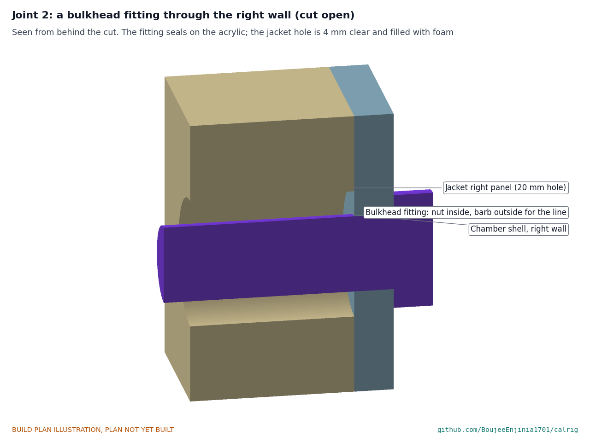

*Figure 11. A bulkhead fitting cut open: it seals on the acrylic with an O-ring outside and a nut inside; the jacket hole is 4 mm clear and is filled with foam after fitting.*

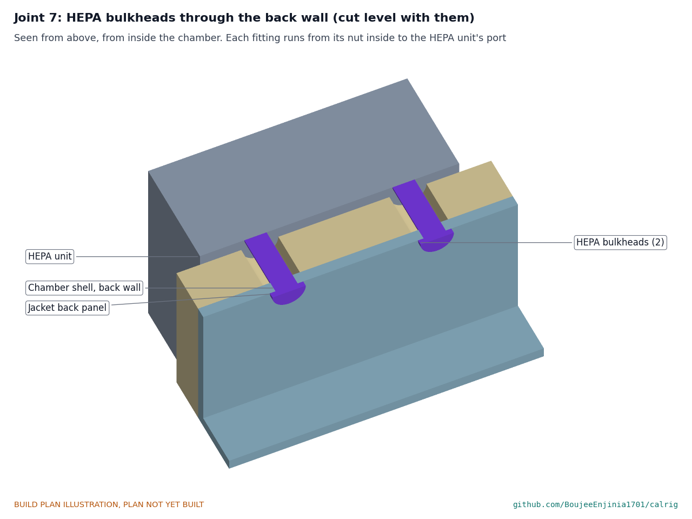

*Figure 12. The two HEPA fittings run straight from their nuts inside to the HEPA unit's ports.*

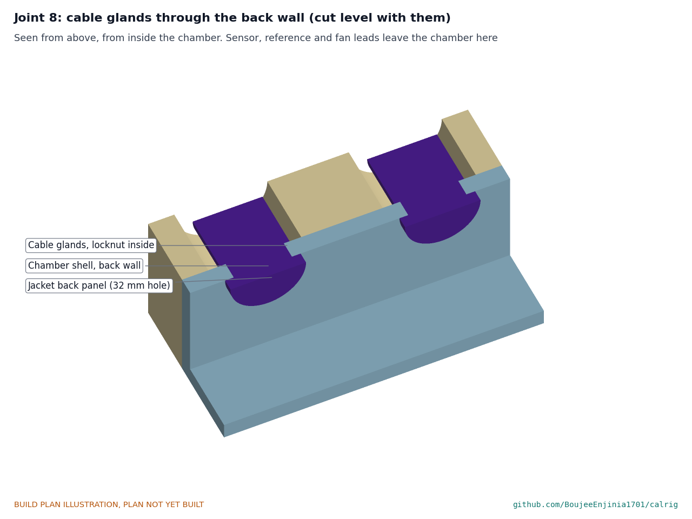

*Figure 13. The two cable glands, with their locknuts inside the chamber.*

**What they are.** Bought fittings that take air, water and leads through the sealed walls: three 12 mm barbed bulkheads in the right wall (wet inlet at the front, dry inlet at the back, suction low between them), two 12 mm barbed bulkheads in the back wall to the HEPA unit, one 6 mm barbed bulkhead for the drain, two M20 cable glands with multi-hole seal inserts in the back wall, and the aerosol port: a 16 mm bulkhead with a Luer fitting and a small ball valve.

**What to do to them.** Nothing but fit them (step 3): each goes in from outside with its O-ring on the outside face, and its nut is tightened from inside through the open front. Check each one's thread size against the 12, 6, 20 and 16 mm holes before cutting the shell. After the jacket is on, fill the clearance round each fitting with a foam offcut and seal the surface with tape.

**Check before moving on.** Each fitting sits square and does not turn by hand once tight.

### 3.7 Peltier heat pump

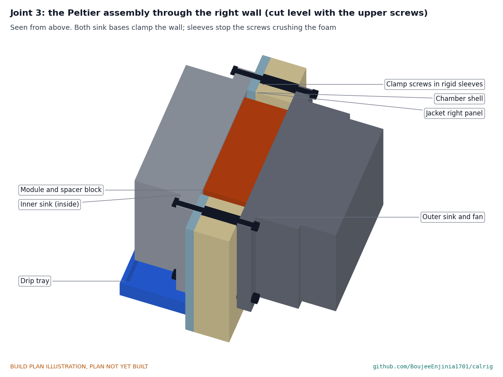

*Figure 14. Cut level with the upper clamp screws: the inner and outer sink bases clamp the wall between them, the module and spacer block sit in the opening, and rigid sleeves carry the screws through the foam.*

**What it is.** A bought 12 V air-to-air thermoelectric assembly of about 60 W, with its stock inner sink replaced by a larger fin block (about 45 x 120 x 110 mm) and fan. Both sink bases must be at least 120 x 110 mm.

**What to do to it.**

1. Drill four 4.2 mm clamp holes through each sink base, 57 mm either side of the centre and 42 mm above and below it, matching the shell's clamp holes.
2. Cut four rigid sleeves 25 mm long from 8 mm outside, 4 mm bore plastic tube.
3. Spread a thin layer of thermal paste on both faces of the module.

**How it fits the parts next to it.** The inner sink's base sits flat on the inside of the right wall over the opening, with a thin foam gasket; the outer sink's base sits flat on the jacket over the same opening. The 80 x 80 mm module and spacer block sits between them in the 90 x 100 mm opening, 5 mm clear all round; fill that gap with foam offcuts and sealant. Four M4 stainless screws pass through both bases, the wall and the sleeves; tighten them evenly in a cross pattern so the module is squeezed flat.

**Check before moving on.** Both sinks sit flat; the module cannot be moved; nothing touches the acrylic but the inner sink's base and its gasket.

### 3.8 Mixing fan

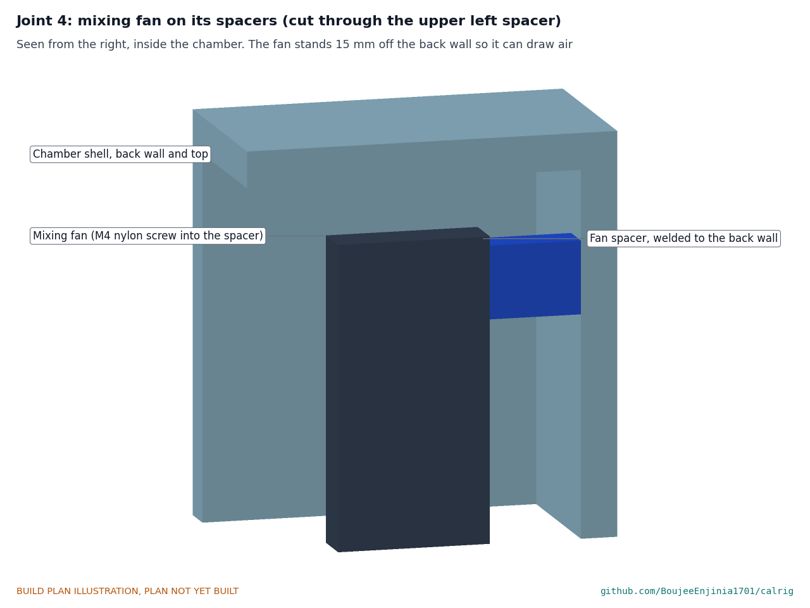

*Figure 15. Cut through the upper left spacer: the fan stands 15 mm off the back wall on its welded spacers.*

**What it is.** A bought 120 mm, 12 V fan with speed control and a finger guard.

**How it fits the parts next to it.** It screws to the four spacers on the back wall with four M4 nylon screws, blowing toward the door, 10 mm below the top and 20 mm from the left wall. Its lead runs down the back wall to a cable gland.

**Check before moving on.** The blades turn freely by hand and clear the guard.

### 3.9 Sensor tray

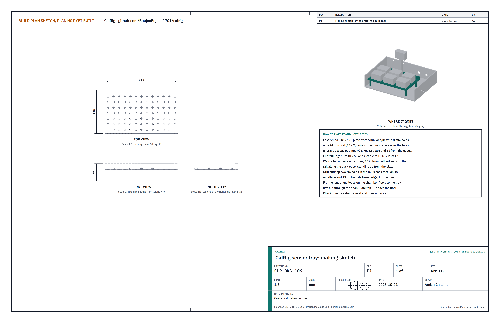

*Figure 16. Sensor tray making sketch (CLR-DWG-106).*

**What it is and what it is made from.** The perforated shelf that holds six sensor heads at the largest size the rig takes (90 x 70 x 50 mm), with a cable rail along its back. Cast acrylic sheet 6 mm.

**How to make it.**

1. Laser cut a 318 x 176 mm plate with 8 mm holes on a 24 mm grid (13 by 7), leaving out the four corner holes. Engrave six bay outlines 90 x 70 mm, 12 mm apart and 12 mm from the edges.
2. Cut four legs 10 x 10 x 50 mm and a rail 318 x 25 x 12 mm.
3. Weld a leg under each corner, 10 mm in from both edges, and the rail along the back edge, standing up from the plate.
4. Drill and tap two M4 holes in the rail's back face, on its middle, 6 and 19 mm up from its lower edge.

**How it fits the parts next to it.** The legs stand loose on the chamber floor, 10 mm from the left wall and 16 mm behind the front opening; the plate top is 56 mm above the floor and the tray lifts out through the door. Nothing on it touches the drip tray or the inner sink.

**Check before moving on.** The tray stands level and does not rock.

### 3.10 Reference mast and cluster

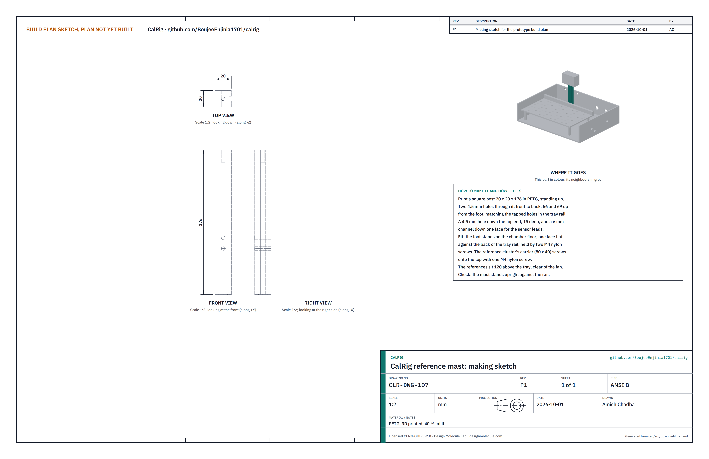

*Figure 17. Reference mast making sketch (CLR-DWG-107).*

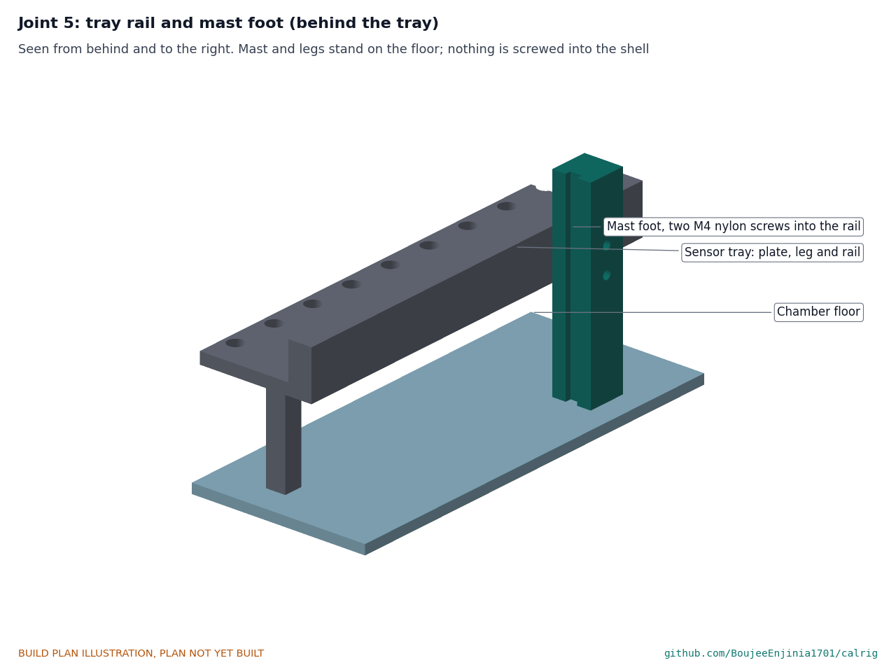

*Figure 18. The mast stands on the floor against the back of the tray rail; the tray's legs stand on the floor too, so nothing is screwed into the shell.*

**What it is and what it is made from.** A square post that holds the reference cluster (two SHT45 temperature and humidity sensors, an SCD30 carbon dioxide sensor and the SPS30 particle sensor on an 80 x 40 mm carrier) 120 mm above the tray. PETG, printed standing up, 40 % infill.

**How to make it.**

1. Print a 20 x 20 x 176 mm post with two 4.5 mm holes through it front to back, 56 and 69 mm up from the foot, a 4.5 mm hole 15 mm deep down its top end, and a 6 mm channel down one side for the leads.
2. Mount the four reference sensors on their carrier as their makers describe.

**How it fits the parts next to it.** The foot stands on the chamber floor with one face flat against the back of the tray rail, held by two M4 nylon screws into the rail. The carrier screws onto the top with one M4 nylon screw. The leads run down the channel to a cable gland.

**Check before moving on.** The mast stands upright; the references clear the mixing fan by 30 mm.

### 3.11 Dryer socket

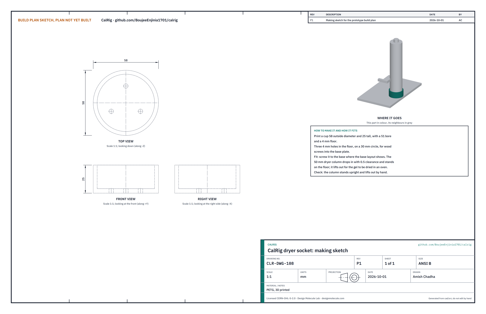

*Figure 19. Dryer socket making sketch (CLR-DWG-108).*

**What it is and what it is made from.** A cup that holds the 50 mm dryer column upright on the base. PETG, printed.

**How to make it.** Print a cup 58 mm outside diameter and 25 mm tall with a 51 mm bore, a 4 mm floor and three 4 mm screw holes on a 30 mm circle.

**How it fits the parts next to it.** Screw it to the base where Figure 3 shows. The column drops in with 0.5 mm clearance and lifts out so the gel can be dried in an oven.

**Check before moving on.** The column stands upright and lifts out by hand.

### 3.12 Jar rack

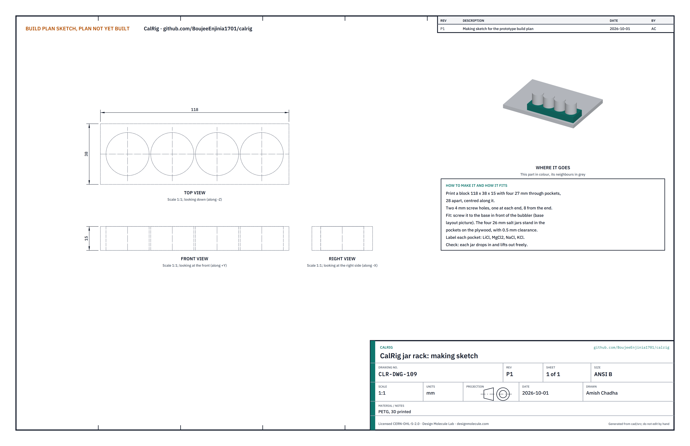

*Figure 20. Jar rack making sketch (CLR-DWG-109).*

**What it is and what it is made from.** A block that keeps the four salt jars upright and in order. PETG, printed.

**How to make it.** Print a block 118 x 38 x 15 mm with four 27 mm pockets 28 mm apart and a 4 mm screw hole 8 mm from each end. Label the pockets LiCl, MgCl2, NaCl and KCl.

**How it fits the parts next to it.** Screw it to the base in front of the bubbler (Figure 3). The 26 mm jars stand on the plywood in the pockets with 0.5 mm clearance.

**Check before moving on.** Each jar drops in and lifts out freely.

### 3.13 Door

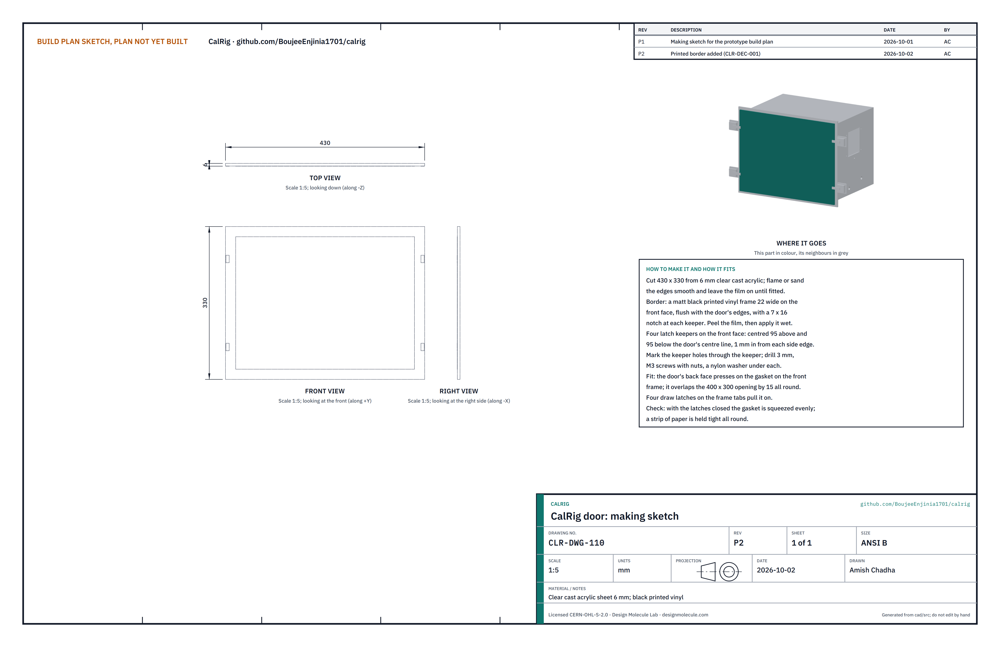

*Figure 21. Door making sketch (CLR-DWG-110).*

**What it is and what it is made from.** The clear front of the chamber, held against the gasket by four draw latches. Clear cast acrylic sheet 6 mm.

**How to make it.**

1. Cut 430 x 330 mm. Sand or flame the edges smooth and leave the protective film on until it is fitted.
2. Place a latch keeper on the front face at each latch: centred 95 mm above and 95 mm below the door's centre line, 1 mm in from each side edge. Mark the holes through the keeper, drill 3 mm, and fit M3 screws with nuts and a nylon washer under each.

**How it fits the parts next to it.** The back face presses on the gasket on the front frame and overlaps the 400 x 300 mm opening by 15 mm all round. The latches on the frame tabs hook the keepers (Figure 25).

**Check before moving on.** With the latches closed, a strip of paper trapped between door and gasket is held tight all round.

### 3.14 Door panel

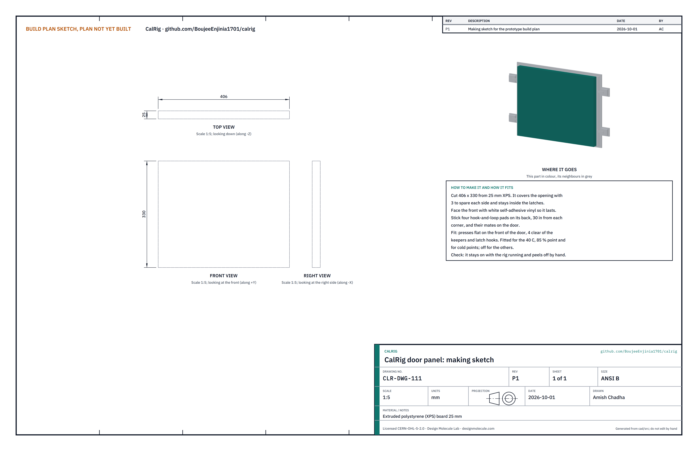

*Figure 22. Door panel making sketch (CLR-DWG-111).*

**What it is and what it is made from.** A removable foam panel that insulates the door for the hot, humid set point and for cold points. Extruded polystyrene board 25 mm.

**How to make it.** Cut 406 x 330 mm, face the front with white self-adhesive vinyl, and stick four hook-and-loop pads on its back, 30 mm in from each corner, with their mates on the door.

**How it fits the parts next to it.** It presses flat on the front of the door between the latches, 4 mm clear of the keepers and latch hooks, and covers the opening with 3 mm to spare each side.

**Check before moving on.** It stays on with the fans running and peels off by hand.

### 3.15 Air loops and wiring

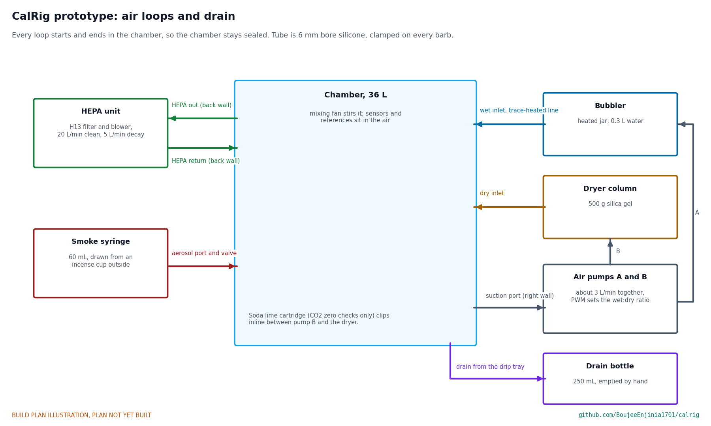

*Figure 23. Every air loop starts and ends in the chamber, so the chamber stays sealed.*

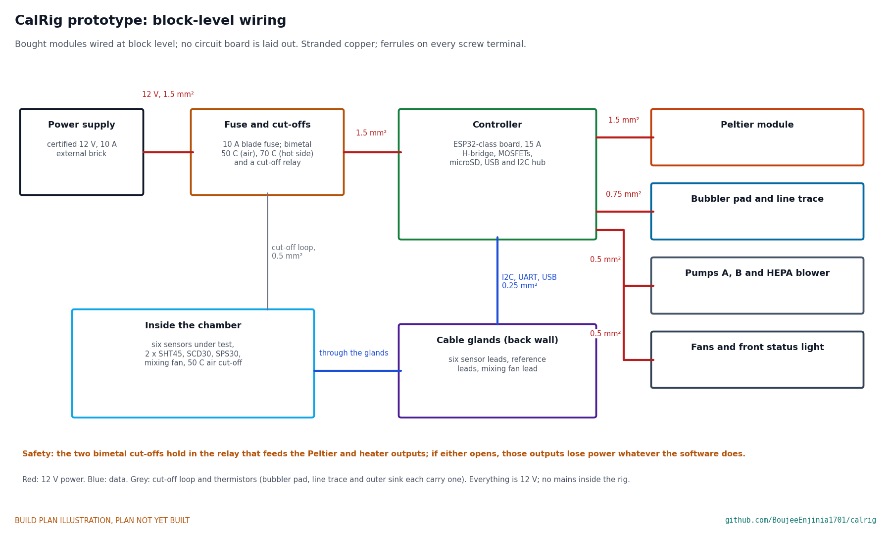

*Figure 24. Block-level wiring with wire sizes. No circuit board is laid out at this stage; bought modules stand in for the power board.*

The power board in the bill of materials is a set of bought modules for this prototype:

*Table 2. Modules that make up the controller and power board.*

| Module | What to buy |
| --- | --- |
| Controller | ESP32-class development board with a microSD socket and a USB and I2C hub for the six sensors and the references |
| Heat pump driver | 12 V H-bridge rated 15 A or more, so the controller can heat or cool |
| Fan, pump and heater switches | Logic-level MOSFET modules, one per load, with flyback diodes on the fans and pumps |
| Cut-offs | Two normally closed bimetal switches, 50 °C (stuck to the inside of the top, near the fan) and 70 °C (screwed to the outer sink's base), in series with the coil of a 12 V relay rated 10 A that feeds the heat pump and heater outputs |
| Fuse | 10 A blade fuse in an inline holder at the supply input |

Wire it like this, with stranded copper and a ferrule on every screw terminal:

1. Supply to the fuse, and the fuse to the controller's power input: 1.5 mm² (16 AWG).
2. Heat pump driver to the module: 1.5 mm².
3. Heater switch to the bubbler pad and line trace: 0.75 mm² (18 AWG).
4. Switches to the pumps, HEPA blower and fans: 0.5 mm² (20 AWG).
5. The two cut-offs in series with the relay coil: 0.5 mm², twisted.
6. Sensors and references through the cable glands to the hub: 0.25 mm² (24 AWG) or their own leads.
7. Thermistors on the bubbler pad, the line trace and the outer sink to the controller: 0.25 mm², twisted.

Run the tubes as Figure 23 shows, with 6 mm bore silicone tube and a clamp on every barb. The soda lime cartridge clips in between pump B and the dryer only for carbon dioxide zero checks.

**Check before moving on.** Every wire continues end to end; with the supply off, the 12 V bus reads open to ground; every wire and tube is labelled.

### 3.16 Bought components

Buy to specification, not brand. Line numbers are those of the bill of materials.

- **Peltier heat pump (line 5).** As section 3.7; sink bases at least 120 x 110 mm.
- **Mixing fan (line 6).** 120 mm, 12 V, about 85 m³/h free air, speed control, guard.
- **Reference cluster (line 8).** Two SHT45 breakouts, an SCD30 and an SPS30 that has been collocated at a monitoring station before use.
- **Bubbler (line 9).** 500 mL glass jar filled to 300 mL, air stone, 10 W 12 V heater pad with thermistor, 10 mm foam sleeve, 12 V diaphragm pump of about 1.5 L/min, outlet line with a 3 W trace heater under foam.
- **Dryer column (line 10).** 50 mm acrylic tube about 230 mm long with 500 g of indicating silica gel, and the second pump.
- **HEPA unit (line 11).** H13 filter cartridge and a 60 mm variable-speed blower in a housing with two 12 mm ports 80 mm apart, or one you can drill to match.
- **Aerosol port (line 12).** 16 mm bulkhead with a female Luer fitting, small ball valve, 60 mL syringe, metal incense cup.
- **Controller and power board (line 13).** As Table 2.
- **Power supply (line 14).** Certified external 12 V, 10 A supply with a regional mains lead.
- **Salt jars (line 15).** Four sealed jars of saturated LiCl, MgCl2, NaCl and KCl slurry with sensor lid adapters.
- **Door hardware (line 2).** Silicone D-section gasket about 10 mm wide; four small draw latches with keepers that fit a 41 x 40 mm tab.
- **Fittings (line 19).** As section 3.6, plus a 250 mL bottle with a lid and 6 mm drain tube.
- **Wiring and consumables (line 17).** Wire, ferrules, silicone tube and clamps, foam-safe adhesive, foil tape, acrylic solvent cement, M3 and M4 nylon and stainless screws, wood screws, hook-and-loop pads, labels.

## 4. Putting it together

In each picture the parts already fitted are grey and the parts being fitted are in colour, with an arrow showing the way they go in.

### Step 1: jacket bottom panel onto the base plate

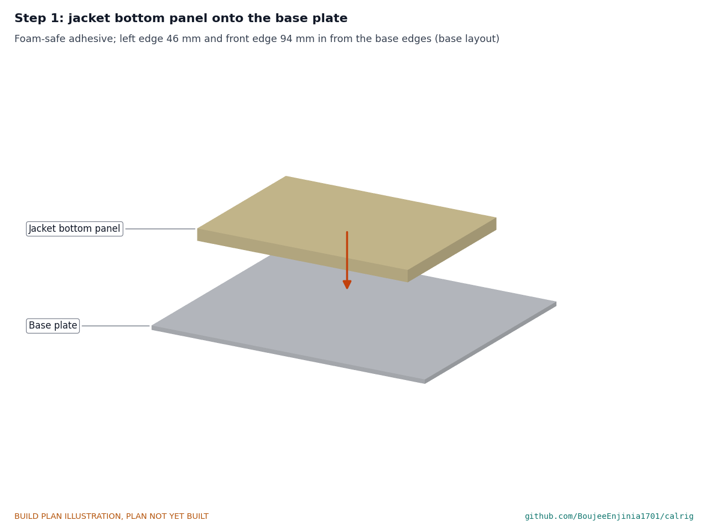

Foam-safe adhesive on the base; the panel 46 mm from the left edge and 94 mm from the front edge. Weigh it down until the adhesive sets.

### Step 2: chamber shell onto the jacket

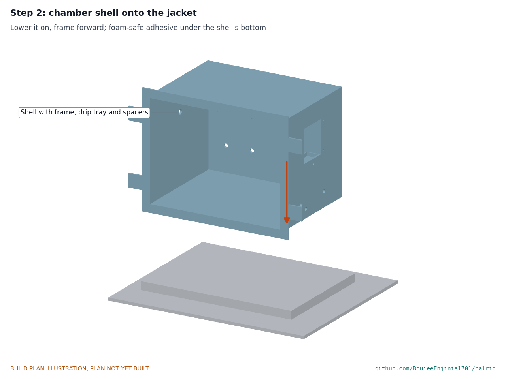

The shell, with its frame, drip tray and spacers already welded, goes down onto the bottom panel, frame forward, on a bead of foam-safe adhesive. Its sides line up with the panel's sides.

### Step 3: bulkheads, glands and aerosol port into the walls

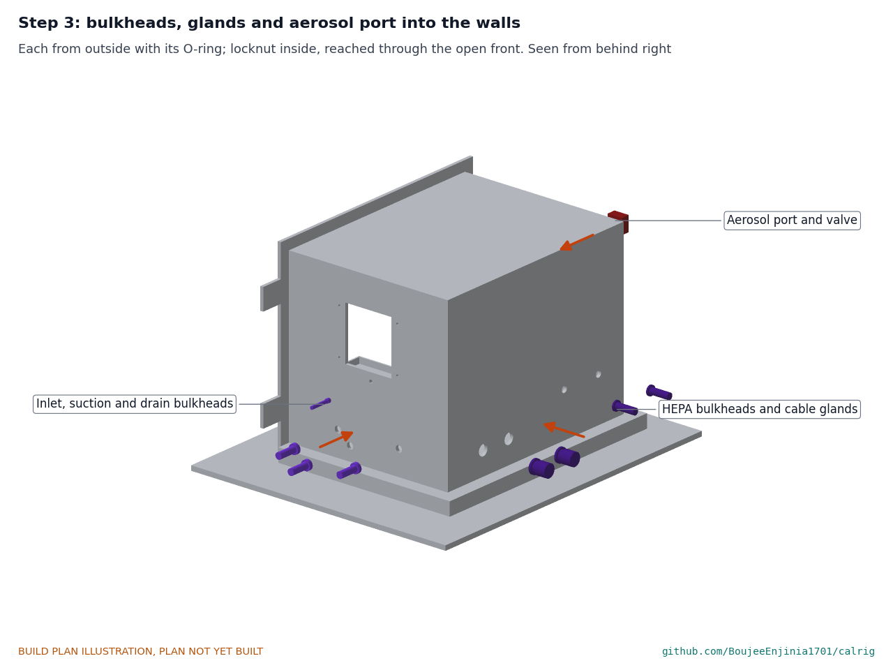

Each from outside with its O-ring on the outside face; nut or locknut tightened from inside through the open front. Seen from behind and to the right.

### Step 4: jacket back, side and top panels

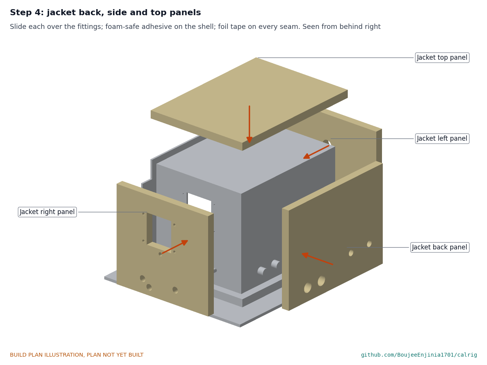

Slide each panel over the fittings, glue it to the shell with foam-safe adhesive and tape every seam with foil tape. Push the clamp sleeves into the right panel's four small holes. Fill round each fitting with foam offcut.

### Step 5: heat pump through the right wall

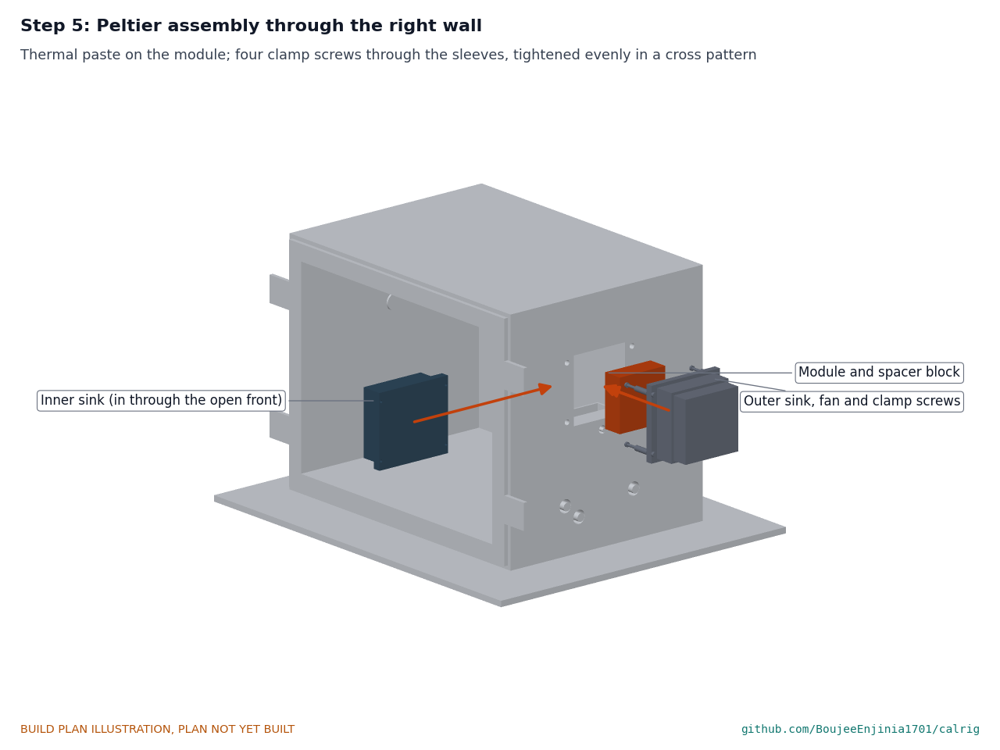

Inner sink in through the open front onto its gasket; module and spacer block into the opening with thermal paste; outer sink and fan on the outside; four clamp screws through both bases, the wall and the sleeves, tightened evenly in a cross pattern. Seal the gap round the block. **Hold point:** safety stop S2 before the heat pump is ever powered.

### Step 6: mixing fan onto its spacers

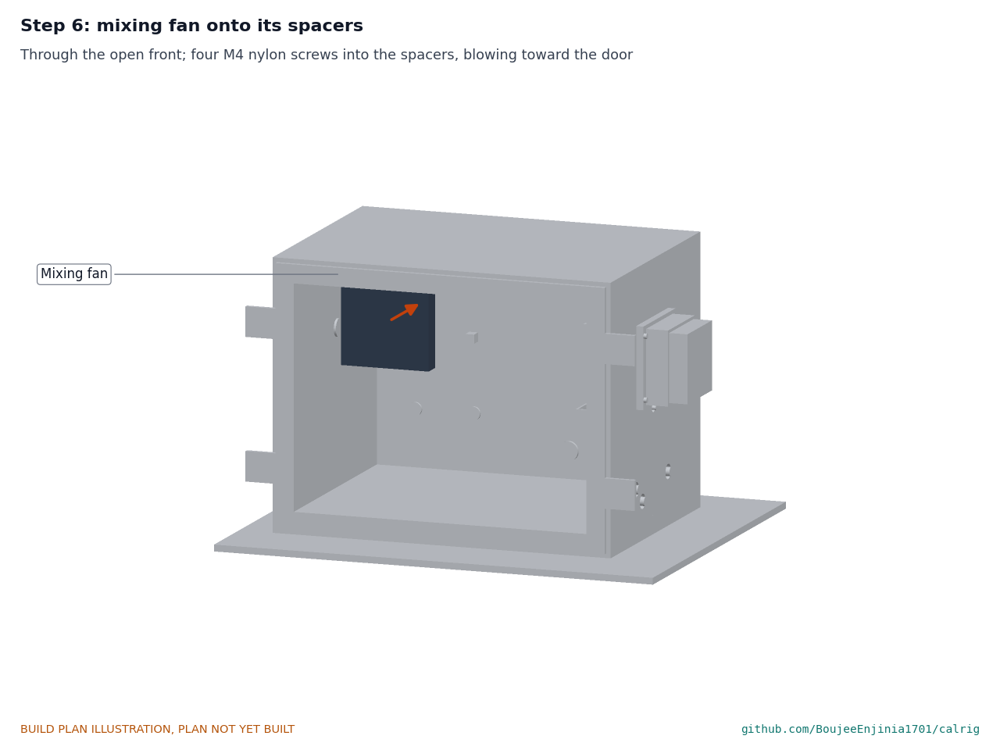

Through the open front; four M4 nylon screws into the spacers, the fan blowing toward the door. Run its lead down the back wall to a gland.

### Step 7: sensor tray in

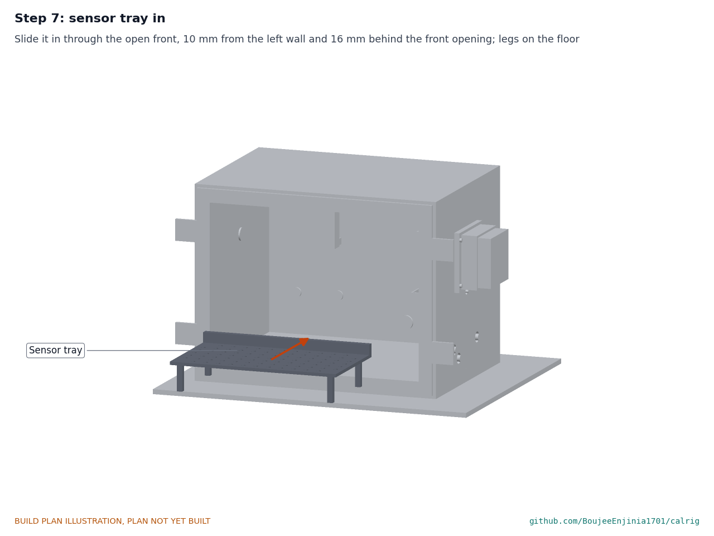

Slide it in through the open front, 10 mm from the left wall and 16 mm behind the front opening, legs on the floor.

### Step 8: reference mast and cluster

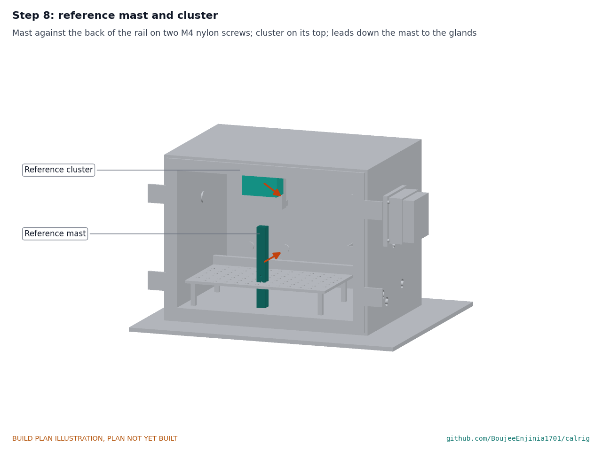

Mast against the back of the rail on two M4 nylon screws; carrier on its top. Run the reference and sensor leads through the multi-hole inserts of the glands and tighten the gland caps.

### Step 9: HEPA unit, controller and power supply onto the base

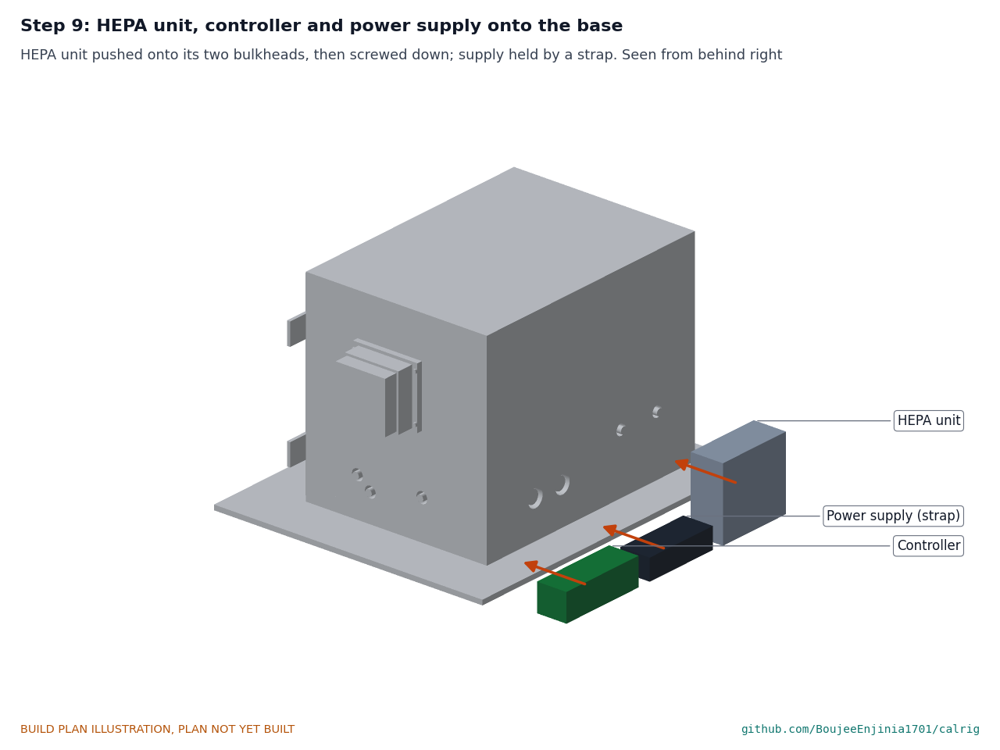

Push the HEPA unit onto its two fittings, clamp the joints and screw it down; screw the controller down; strap the supply down. Seen from behind and to the right. Wire as Figure 24, with the fuse out.

### Step 10: pumps, bubbler, dryer and drain bottle

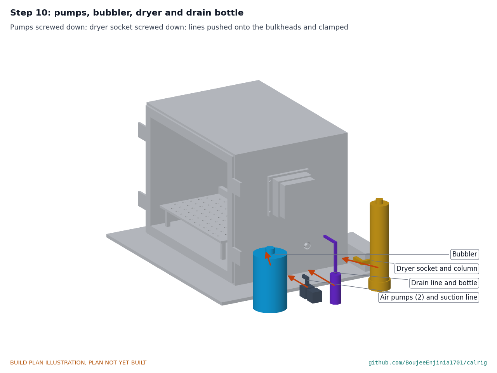

Screw the pumps and the dryer socket down; set the bubbler and the bottle on their pads; push each line onto its fitting and clamp it, as Figure 23. The bubbler stays empty until safety stop S3.

### Step 11: jar rack and salt jars

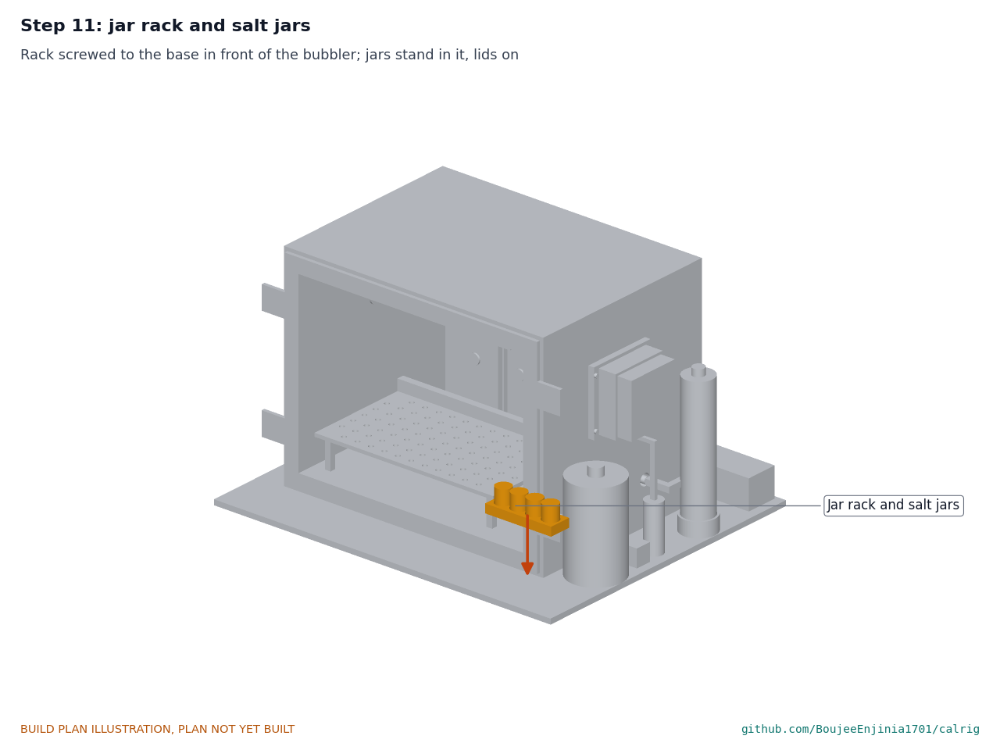

Screw the rack down in front of the bubbler; stand the four jars in it with their lids on.

### Step 12: gasket, door and latches

Stick the gasket on the frame's face, 4 to 12 mm outside the opening, with its joint at the bottom. Screw the four latches to the frame tabs, hold the door on the gasket and close the latches.

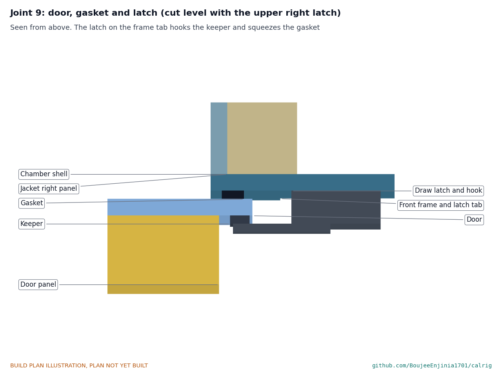

*Figure 25. Cut level with the upper right latch: the latch on the frame tab hooks the keeper on the door and squeezes the gasket between door and frame.*

### Step 13: door panel

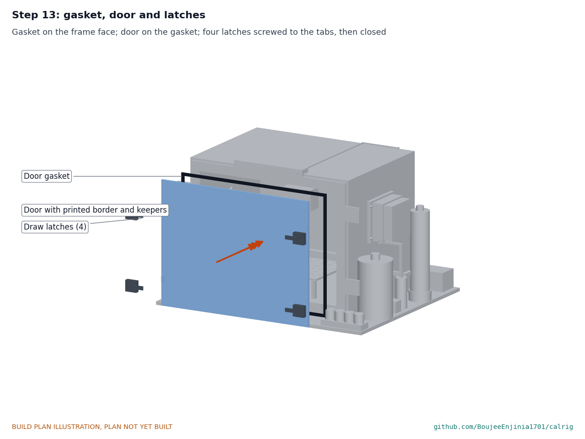

Press the panel onto the four hook-and-loop pads on the door, between the latches. It is fitted for the 40 °C, 85 % RH point and for cold points, and off for the others.

## 5. First checks

These are the checks a TRL 4 test report would record; this plan only lists them. Requirement numbers are those of CLR-REQ-001.

*Table 3. First checks.*

| Check | Requirement | How | Pass when |
| --- | --- | --- | --- |
| Shell leak | R2, R7 | 10 mm of water in the shell for an hour (section 3.3), before the jacket goes on | No water at any weld |
| Door seal | R2, R7 | Paper strip trapped at 20 points round the closed door | Held tight at every point |
| Fit of the heads | R10 | Six 90 x 70 x 50 mm blocks in the bays, door closed; leads through the glands | Everything fits; the gland caps seal round the leads |
| Fuse and supply | R15 | Supply on, fuse in, every load off, then the heat pump at full drive with all fans, pumps and heaters on | Bus current 7.5 A or less; no part warm but the loads |
| Cut-offs | R16 | Each bimetal switch warmed in a water bath with a thermometer | The relay drops out at 50 °C and at 70 °C (within the switch's tolerance) and the heat pump and heaters lose power |
| Heat pump direction | R1 | Short runs at low drive in each direction | The inner sink warms when heating and cools when cooling; the outer fan runs whenever the module is powered |
| Air loops | R2 | Each pump and the HEPA blower in turn, a soap film on each joint | Bubbles leave only where Figure 23 says air goes; no leak at any barb |
| Drain | R2 | 20 mL of water poured into the drip tray | All of it reaches the bottle |
| Clean-down | R7 | HEPA unit at full speed, references logging | Particle reading falls below 2 µg/m³ |
| Size and mass | R13 | Tape measure; bathroom scale with and without the rig held | Within 600 x 500 mm and 400 mm high; 14 kg or less (13.8 kg estimated) |

## 6. Safety stops

Stop at each point. Carry on only when everything listed is true.

- **S1. Before cutting and welding acrylic.** Laser cutting in a cutter with working extraction; solvent cement used in a ventilated space with gloves and eye protection; no flame near the cement.
- **S2. Before the heat pump is powered.** Both sinks clamped flat with paste on the module; the outer fan runs whenever the module is powered (wired so it cannot be switched off while the module is on); both cut-offs wired in series with the relay coil and checked as in section 5; the 10 A fuse in place; the supply is certified and undamaged.
- **S3. Before the bubbler is filled and its heater powered.** Thermistors fitted to the pad and the line trace; the cut-off relay feeds the heater; the jar stands in its foam sleeve on its pad; the electronics stand behind the chamber, higher than any spilled water can reach. Fill with distilled water only.
- **S4. Before the first smoke run.** The room is ventilated; the incense cup stands outside the chamber on a non-combustible surface; the door is closed and latched; the HEPA unit is running. The door opens only after the references read below 5 µg/m³.
- **S5. Before handling soda lime or the salt slurries.** Gloves and eye protection on; containers labelled; children kept away. Exhaled-air carbon dioxide checks use a single-user bag and filter.
- **S6. Before the first unattended run.** One full sweep has been watched from start to finish, with the outer sink staying below 60 °C and the chamber air below 45 °C; the rig stands on a non-combustible bench away from paper and curtains.

## 7. Tools, skills and workspace

**Tools.** Laser cutter able to cut 6 mm cast acrylic (a maker space or a cutting service) or a fine-toothed saw and a router; acrylic solvent cement with a needle applicator; corner clamps and square blocks; fine-toothed saw or hot-wire cutter for foam board; drill with 3, 4.2 and 4.5 mm bits and a step drill to 20 mm; M3 and M4 taps; 3D printer able to print PETG (bed at least 120 x 60 mm, height 180 mm); screwdrivers and nut drivers; side cutters, wire strippers and a ferrule crimper; soldering iron; multimeter; digital thermometer; tape measure, steel rule and square; bathroom scale.

**Skills.** No certified trade is needed. Marking out, laser cutting or sawing acrylic, solvent welding, cutting foam board, drilling and tapping, 3D printing, crimping and soldering, and safe use of a 12 V supply. Everything runs at 12 V from a certified external supply; no mains wiring is part of this build.

**Workspace.** A bench about 1.2 x 0.8 m in a ventilated room; a flat surface to weld the shell square; a separate corner for solvent work; a sink for the leak check.

**Personal protective equipment.** Safety glasses for cutting, drilling, welding and soldering; nitrile gloves for solvent cement, soda lime and salts; a dust mask when sanding acrylic.

## 8. Where the numbers come from

- Model and constructability checks: `cad/src/model.py` (`python cad/src/model.py --check`, 79 checks); STEP and STL exports in `cad/step/` and `cad/stl/`.
- Pictures: `cad/src/build_plan_media.py`, using `.kit/build_views.py`; written to `docs/05-build-plan/` and `cad/drawings/CLR-DWG-101` to `CLR-DWG-111`.
- General arrangement: `cad/drawings/CLR-DWG-001.pdf`, Rev P4.
- Calculations: `docs/04-calcs/01-sizing.md` (CLR-CAL-001 v0.4) and `docs/04-calcs/sizing.py`; mass [A3], heat capacity and ramps [B7, B8], power [J1], cut-offs [J2], cost [K1].
- Bill of materials: `bom/bom.csv` and `bom/bom-notes.md`.
- Decisions: `docs/decisions/0003-design-for-construction.md` (CLR-DDR-003), with CLR-DDR-001 and CLR-DDR-002; open items in `docs/06-design-decisions.md` (CLR-DEC-001).
- Requirements: `docs/03-requirements.md` (CLR-REQ-001 v0.6).
